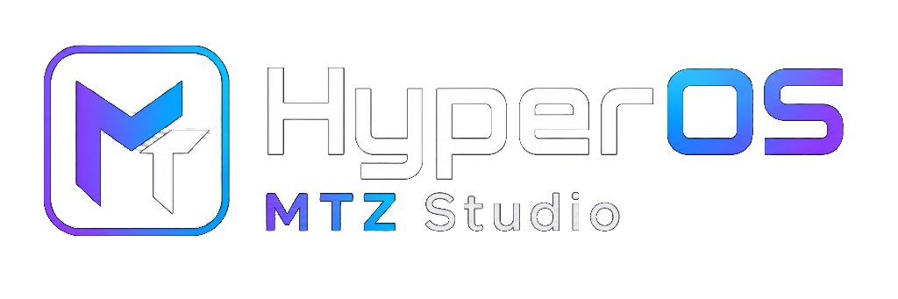
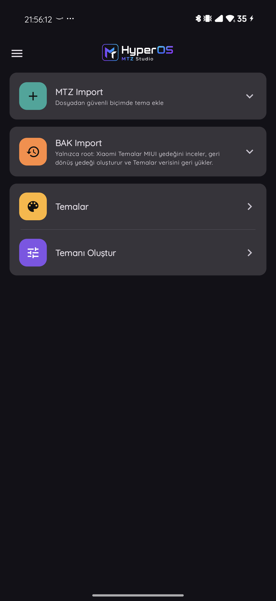
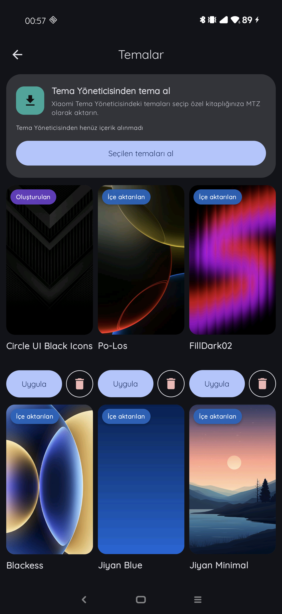
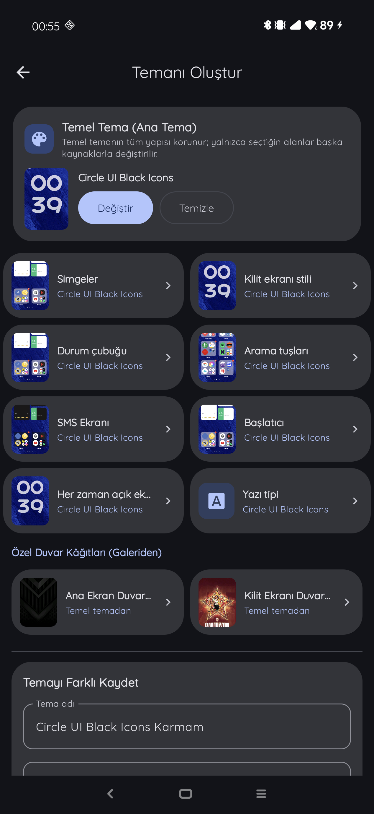

# HyperOS MTZ Studio

<p align="center">
  
</p>

<p align="center">
  <strong>Import, organize, preview, mix and apply MTZ themes from one modern Android studio.</strong>
</p>

<p align="center">
  <a href="https://github.com/GloriousTR/HyperOS-MTZ-Studio/releases/latest"></a>
  
  
</p>

<p align="center">
  <a href="https://github.com/GloriousTR/HyperOS-MTZ-Studio/releases/latest"><strong>Download the latest APK</strong></a>
  ·
  <a href="docs/theme-manager-compatibility.md">Theme Manager compatibility</a>
  ·
  <a href="https://github.com/GloriousTR/HyperOS-MTZ-Studio/issues">Report an issue</a>
</p>

---

## The MTZ workflow, rebuilt

HyperOS MTZ Studio is an independent, open-source Android application for Xiaomi HyperOS and MIUI devices. It keeps imported and generated themes in a private library, presents them with real previews, and lets you build a new MTZ by combining the parts you actually want.

<p align="center">
  
  &nbsp;
  
  &nbsp;
  
</p>

## What you can do

- **Import MTZ files safely.** Inspect structure and metadata before adding a theme to the app library.
- **Bring themes from Xiaomi Theme Manager.** Scan compatible device theme locations and select the themes you want to preserve as MTZ files.
- **Browse a visual theme library.** Home-screen previews, clear source labels, compact Apply actions and dedicated delete controls keep large collections manageable.
- **Create your own theme.** Start from a complete base theme and replace any of eight visual components:
  - Icons
  - Lock screen
  - Status bar
  - Dialer and contacts
  - Messages
  - Launcher
  - Always-on display
  - Font
- **Choose wallpapers independently.** Use the base theme wallpapers or select separate home-screen and lock-screen images from the gallery.
- **Preserve creator information.** Leave the creator field blank to inherit the original author, or enter your own name for the generated theme.
- **Keep generated previews.** The composer stores a persistent cover inside each generated MTZ so the library shows the theme's real home wallpaper.
- **Export and back up.** Generated themes are saved to the private library and exported to `Downloads/MTZ Studio`. The complete library can also be backed up locally or through the supported cloud destinations.
- **Follow operations live.** Live Diagnostics automatically records startup/provider detection, library sync, composition, import, apply and deletion. It shows the latest 200 detailed events, retains a bounded private journal across restarts, and exports the retained history. Modern Theme Manager steps arrive over the authenticated request's callback channel; failures include available host crash details. Legacy tester returns are labeled unverified, not proof that a theme was applied.

## v2.1.0 highlights

- One APK now selects between two safe providers: the preserved Global MTZ Studio library and the modern Xiaomi Theme Manager library.
- Theme Manager `10.8.7.6` and later builds use Xiaomi's local theme catalog as the source of truth; the redundant “import from Theme Manager” card is hidden.
- Themes created or added in MTZ Studio are saved to `Downloads/MTZ Studio` and transferred into Xiaomi Theme Manager automatically.
- Apply and remove actions are routed through Theme Manager's native resource operations. The public MTZ backup is retained when a catalog item is removed.
- Verified modern compatibility surface: `10.8.7.6`, `10.9.2.0`, `10.9.4.0`, `10.9.5.2`, `11.0.8.0`, and `11.1.5.0`.
- Global `2.15.5.46` and `3.0.5.6` behavior remains isolated and unchanged.
- v2.1.0 establishes the project's stable release-signing key. Earlier GitHub Actions releases were signed with an ephemeral CI debug key, so Android may reject an in-place upgrade from v2.0.0 or older. Back up the Studio library before reinstalling v2.1.0; releases after v2.1.0 will use the same stable key.

## v2.0.0 highlights

- Device-verified support for the `10.8.7.6` Xiaomi Theme Manager build supplied by the HyperOS Theme Manager module.
- Native 10.8 import bridge: MTZ Studio stages the verified archive, lets Theme Manager split it into its own local resources, applies the resulting local theme and returns the result to MTZ Studio.
- Automatic compatibility selection: the existing v1.2.0 Global workflow remains unchanged on the supported 2.15/3.0 builds.
- The redundant **Global Theme Protection** screen and `system` Xposed scope are automatically disabled and hidden on 10.8.7.6.
- Only the `com.android.thememanager` Xposed scope is retained for the 10.8 import/apply bridge. Vector can be configured from the app with root; compatible LSPosed forks can use their normal scope approval flow.
- MTZ path and SHA-256 verification before the archive enters Theme Manager's private import flow.

## v1.2.0 interface highlights

- Reworked Themes screen with visual cards, compact Apply buttons and trash actions.
- Horizontal base-theme and component selection inside the composer.
- Eight focused component categories; wallpapers are handled separately.
- Persistent preview generation for newly composed MTZ themes.
- Creator-name inheritance and optional author override.
- Consistent two-line theme titles with aligned controls.
- More polished About screen, menu cards and overall visual hierarchy.
- Global Theme Manager apply path retained for the tested 3.0.5.x family.

## Compatibility

| Xiaomi Themes version | Status | Notes |
| --- | --- | --- |
| **2.15.5.46** | Supported legacy path | Imports MTZ as an independent local theme. Installing or downgrading a system app requires root and must be done carefully. |
| **3.0.5.x Global** | Supported | The v1.2.0 Global apply flow is preserved in v2.1.0 and was tested on the 3.0.5.6 build. |
| **3.0.6.8** | Limited | Xiaomi removed the legacy tester activity, so older tester-based flows are unavailable. |
| **10.8.7.6+ modern Theme Manager family** | Supported in v2.1.0 | Xiaomi's local catalog becomes the source of truth. Native import, apply and remove operations are bridged while the Global provider remains isolated. |

The 10.8.7.6 bridge requires root and an enabled modern Xposed environment such as Vector or a compatible LSPosed fork. MTZ Studio does not install the HyperOS Theme Manager module itself. Global builds continue to use their existing version-specific path. HyperOS MTZ Studio only exposes these controls for themes you own or are permitted to use; it does not grant framework, root or theme rights by itself.

See [Theme Manager compatibility](docs/theme-manager-compatibility.md) for the detailed decision flow and diagnostics.

## Interface and accessibility

- Material You and Liquid Glass presentation styles.
- System, Light, Dark and AMOLED color modes.
- System-language integration with Turkish and English resources.
- Contrast-aware text and surfaces across every appearance combination.
- Settings, backup, diagnostics and About collected in a large, card-based overlay menu.

## Project structure

| Module | Responsibility |
| --- | --- |
| `app` | Jetpack Compose UI, navigation, theme previews, Xposed integration, Shevery/root coordination and export flow. |
| `mtz-core` | Hardened MTZ parsing, metadata extraction, component recognition and SHA-256 validation. |
| `mtz-library` | App-private theme storage, indexing, device scanning and backup/restore. |
| `mtz-composer` | Deterministic component composition, wallpaper handling and reopen verification. |
| `tester-adapter` | Xiaomi Theme Manager inspection, compatibility decisions and privileged runners. |

## Build from source

Requirements:

- JDK 17+
- Android SDK with API 36 installed
- Android 8.0 / API 26 or newer device target

macOS or Linux:

```shell
./gradlew test assembleDebug
```

Windows PowerShell:

```powershell
.\gradlew.bat test assembleDebug
```

Release APK:

```powershell
.\gradlew.bat assembleRelease
```

## Responsible use

Use themes, fonts, icons and artwork only when you own them or have permission from their creators. Xiaomi, HyperOS and MIUI are trademarks of their respective owners; this independent project is not affiliated with or endorsed by Xiaomi.

---

<p align="center">
  Built for theme makers and HyperOS enthusiasts by <a href="https://github.com/GloriousTR">GloriousTR</a>.
</p>
