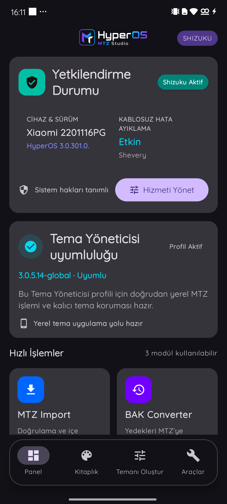
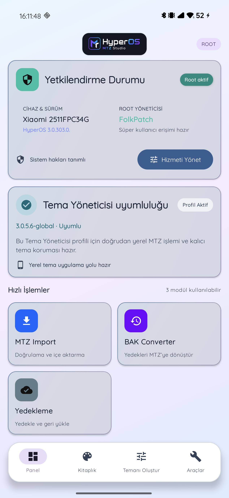
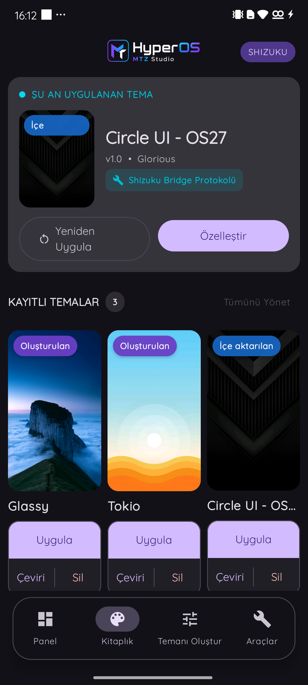
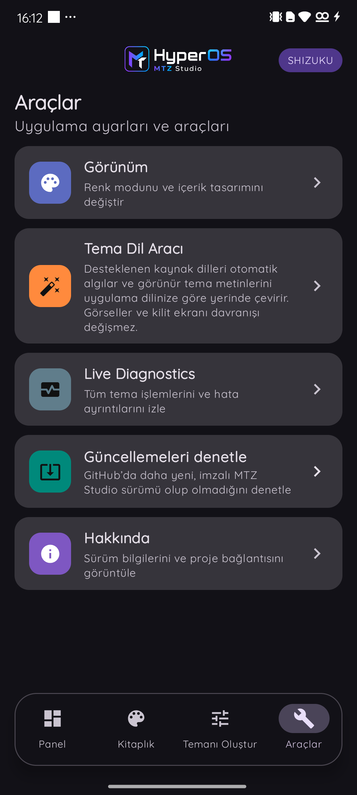

# HyperOS MTZ Studio

<p align="center">
  
</p>

<p align="center">
  An open-source MTZ workspace for Xiaomi HyperOS and MIUI.<br>
  Import, translate, convert, compose and apply themes on compatible devices.
</p>

<p align="center">
  <a href="README.md">🇹🇷 Türkçe</a> · <strong>🇬🇧 English</strong>
</p>

<p align="center">
  <a href="https://github.com/GloriousTR/HyperOS-MTZ-Studio/releases/latest"></a>
  <a href="https://github.com/GloriousTR/HyperOS-MTZ-Studio/actions/workflows/release.yml"></a>
  
</p>

<p align="center">
  <a href="https://github.com/GloriousTR/HyperOS-MTZ-Studio/releases/tag/v4.4.0"><strong>Download v4.4.0 APK</strong></a>
  · <a href="docs/release-notes-v4.4.0.md">Release notes</a>
  · <a href="docs/theme-manager-compatibility.md">Compatibility</a>
  · <a href="https://github.com/GloriousTR/HyperOS-MTZ-Studio/issues">Report an issue</a>
</p>

## v4 interface

<p align="center">
  
  
  
  
</p>

## What it does

- **MTZ Import:** validates MTZ packages, adds them to the private library and produces preview data. Choose one file or batch-import up to five files. On supported modern Xiaomi Themes builds, Shizuku/Shevery also mirrors the theme into Xiaomi's local library.
- **BAK Converter:** converts supported Xiaomi Themes `.bak` backups into MTZ packages and adds the result directly to the library.
- **Theme Language Tool:** translates visible theme text into the app language. It supports XML, JSON and safe MAML content with translation memory and optional API providers.
- **Create Your Theme:** creates a new MTZ by combining selected lock screen, icon, font, wallpaper and other components from different themes.
- **Library:** presents the currently applied theme plus imported and created themes separately from font-only packages. Manage Library supports multi-select removal and, on supported devices, importing local themes from Xiaomi Themes.
- **Backup and updates:** provides cloud/WebDAV backup and restore for the Studio library. Every foreground entry checks GitHub in the background, announces a new version and shows verified APK download progress as a percentage.
- **Live Diagnostics:** records import, conversion, translation and application stages to make Theme Manager issues easier to diagnose.

## Access modes

| Mode | Available workflow |
| --- | --- |
| **Root** | Advanced Theme Manager operations, compatible apply flows and diagnostics through the detected root manager. |
| **Shizuku / Shevery** | BAK Converter, local MTZ operations, theme protection and supported application flows without root. |
| **No authorization service** | The MTZ library, preview, translation, composer, export and backup remain available. Applying a theme requires Shizuku or Shevery. |

On non-rooted devices, install and start Shizuku or [Shevery](https://github.com/HmnDev-Tech/shevery/releases) with Wireless debugging, then grant MTZ Studio permission. The app automatically detects an installed compatible manager.

## Theme Manager compatibility

Studio does not rely only on a fixed Xiaomi Themes version allowlist. At runtime it verifies `ApplyThemeForScreenshot` on legacy Global builds and the native local-theme library on modern 10.8.7.6+ builds. If either route is available, the profile is shown as **Compatible**. If neither is available, Studio shows an explicit incompatibility notice and recovery option.

The recovery action downloads the verified Xiaomi Themes `3.0.5.6-global` package directly through Android Download Manager:

- [Xiaomi Themes 3.0.5.6-global APK](https://github.com/GloriousTR/HyperOS-MTZ-Studio/releases/download/v4.0.0/Xiaomi_Themes_3.0.5.6-global.apk)
- [SHA-256 checksum](https://github.com/GloriousTR/HyperOS-MTZ-Studio/releases/download/v4.0.0/Xiaomi_Themes_3.0.5.6-global.apk.sha256)

Xiaomi can change the final application screen and theme-acceptance behaviour depending on the ROM. Studio verifies capabilities and outcomes at runtime whenever possible, but a Xiaomi confirmation screen may still appear.

## Install

1. Download `MTZ_Studio_v4.4.0.apk` from the [v4.4.0 release](https://github.com/GloriousTR/HyperOS-MTZ-Studio/releases/tag/v4.4.0).
2. Back up an important Studio library before upgrading from an older build.
3. Install the APK, open Studio and let it detect the available access mode.
4. On non-rooted devices, grant the requested Shizuku/Shevery authorization before applying themes.

Official releases from v2.1.0 onward use the same signing key and normally update an existing installation. Android always requires your final confirmation before installing an APK.

## Build

Requirements: JDK 17, Android SDK API 36 and Android 8.0 / API 26 or newer.

```powershell
.\gradlew.bat test assembleDebug
```

Release signing uses `MTZ_RELEASE_STORE_FILE`, `MTZ_RELEASE_STORE_PASSWORD`, `MTZ_RELEASE_KEY_ALIAS` and `MTZ_RELEASE_KEY_PASSWORD`.

## Documentation

- [Architecture](docs/architecture.md)
- [Theme Manager compatibility](docs/theme-manager-compatibility.md)
- [Localization](docs/localization.md)
- [Theme Language Tool](docs/theme-language-translation.md)
- [Privacy and threat model](docs/threat-model.md)

## Responsible use

Use themes, fonts, icons and artwork only when you own them or have permission from their creators. Xiaomi, HyperOS and MIUI are trademarks of their respective owners. This independent project is not affiliated with or endorsed by Xiaomi.

<p align="center">
  Built for HyperOS users and theme makers by <a href="https://github.com/GloriousTR">GloriousTR</a>.
</p>
